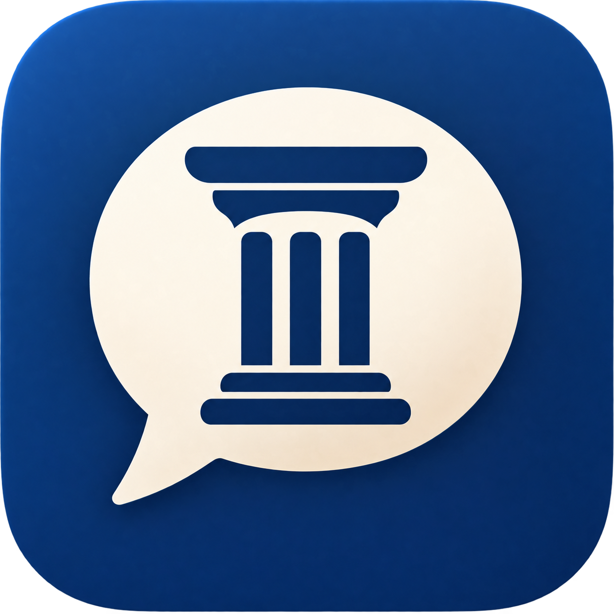
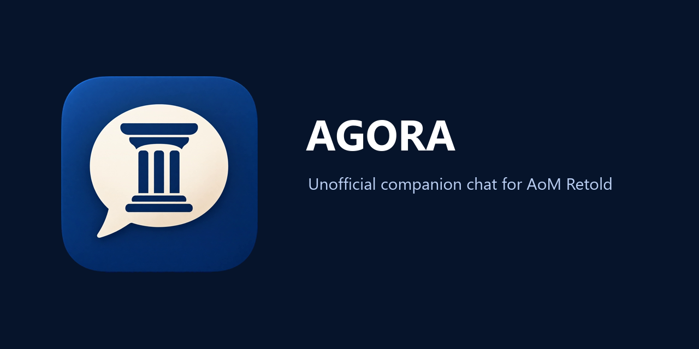

  

<h1 align="center">Agora</h1>

Unofficial Windows companion chat for Age of Mythology: Retold.

  <a href="https://github.com/lero-aom/agora/releases/latest">Download</a>
  | <a href="docs/trust-and-privacy.md">Trust and privacy</a>

  

Since AOM Retold came out, many have been missing the public lobby chat from OG times or voobly. With agora, I aim to solve this issue by having an external overlay that integrates into the interface of AOM Retold (when not in an active game) and provides a way for players to communicate in-game, without resorting to using platform such as discord.

<video controls src="assets/agora-demo.mp4"></video>

To avoid spam and additional login/account creation process, players simply sign-in with their Steam or Microsoft accounts. Passwords and account details are not stored by agora (except username info), as the login process goes through each platform's official authentication systems (e.g. Steam OpenID). See <a href="docs/trust-and-privacy.md">Trust and privacy</a> for more details.  

Agora is an independent community project. It is not affiliated with or endorsed by the Age of Mythology rights holders.

## Download

Download the latest Windows release from [GitHub Releases](https://github.com/lero-aom/agora/releases/latest). Release archives include the executable, checksums, license, source notice, and matching source archive.

The signed executable will automatically update at launch.

## License

Agora is licensed under [AGPL-3.0](LICENSE).
